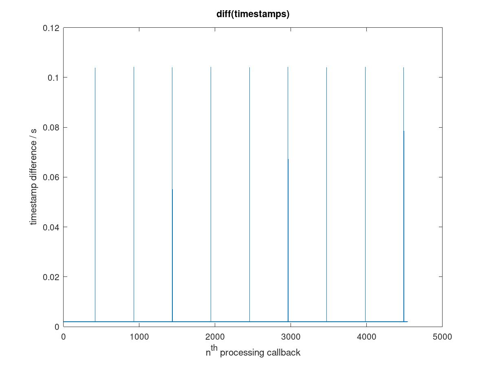
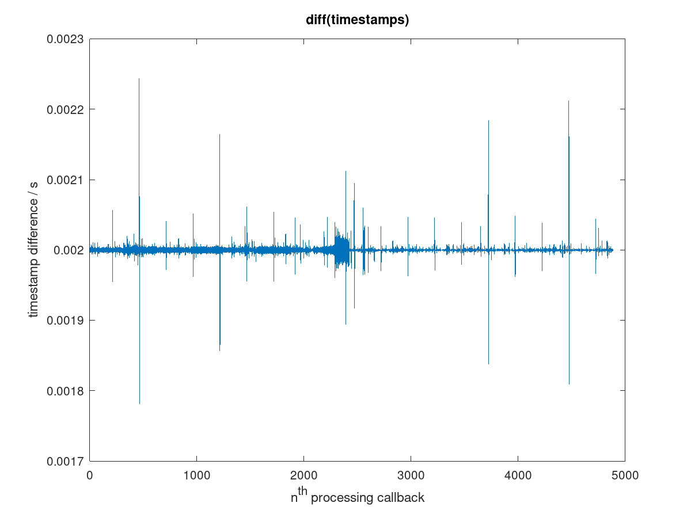
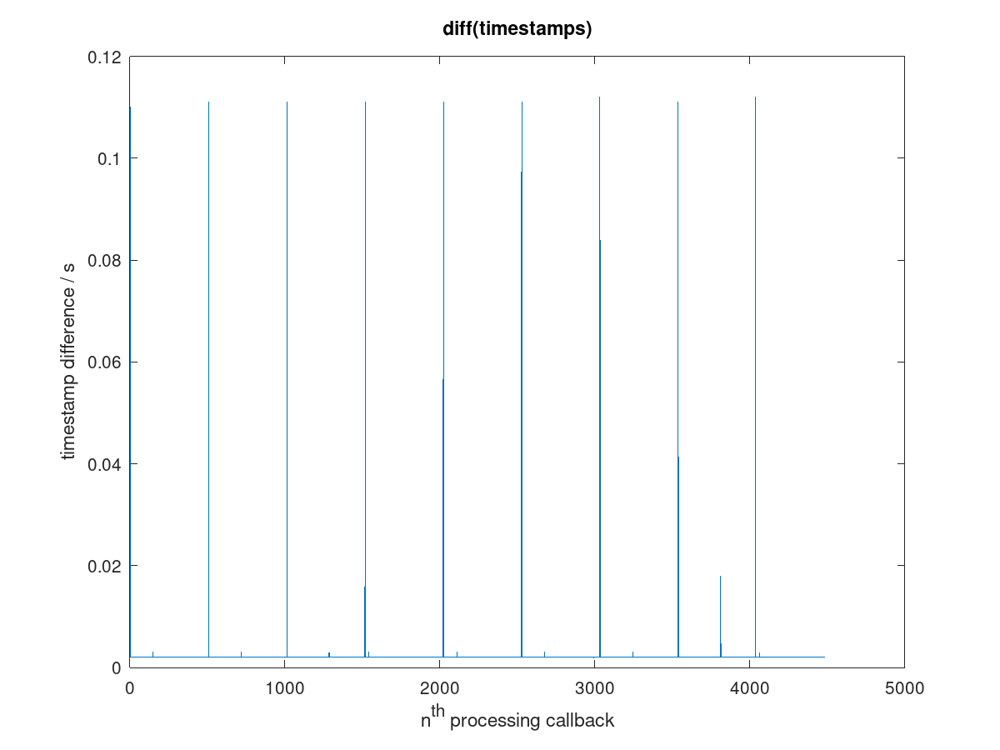

This directory contains some sample data that can be used
to test the dll algorithm, e.g. with Octave.

File `bpi-r48-p96.mat` contains timestamps generated with the command

```
mha fragsize=96 srate=48000 nchannels_in=2 iolib=MHAIOalsa \
    io.in.device=hw:0 io.out.device=hw:0 mhalib=mhachain   \
    mha.algos='[timestamper acsave]' io.format=S16_LE      \
    io.priority=94 mha.acsave.name=onboard$i.mat           \
    mha.acsave.fileformat=mat4 sleep=1 cmd=start sleep=10  \
    cmd=release io.alsa_start_counter?val cmd=quit
```

on a bananapi running Armbian 20.02.0-rc1 Buster. Plotting the differences between the timestamps in octave with
```
load bpi-r48-p96.mat;
plot(diff(timestamper));title 'diff(timestamps)', xlabel 'n^{th} processing callback', ylabel 'timestamp difference / s'
```
produces this graph: .  The graph shows
an average time difference of approximately 2ms, which
corresponds to the period size of 96 samples. The
differences show constant variations between approximately
1.92ms and 2.08ms.  Some high peaks extend beyond 2.2ms,
some low peaks almost reach 1.8ms, and these show a symmetry:  a high peak is always close to a low peak of similar deviation, probably directly adjacent:  there were no dropouts in this measurement, as confirmed by the
`io.alsa_start_counter?val` output, which was 1.  Therefore,
any excess time difference should normally be compensated in
the next processing callback.

(The variations between 1.92 and 2.08ms are not random fluctuations, see [non-random.md](non-random.md))

This particular bananapi produces regular drop-outs on its
internal sound card in about every other timing
measurement.  See file `bpi-r48-p96-dropouts.mat` for an
example.  This data set can be used to test dropout recovery
of the DLL implementation.  The next plot shows these dropouts:
```
load bpi-r48-p96-dropouts.mat;
plot(diff(timestamper));title 'diff(timestamps)', xlabel 'n^{th} processing callback', ylabel 'timestamp difference / s'
```


A USB sound card connected to the same Bananapi produces the
timestamps in file `usb-r48-p96.mat`, plotted here:


This sound card also produces dropouts in approximately
every second measurement, see data in file
`usb-r48-p96-dropouts.mat` plotted here:


From the data without dropouts, the sampling rate with
respect to the computer's system clock (here CLOCK_REALTIME)
can be computed post-hoc with linear regression (least
sqared errors):
```
load usb-r48-p96.mat;
Y=timestamper;
X=[1:length(timestamper)]'*96;
m=(length(X)*sum(X.*Y)-sum(X)*sum(Y))/(length(X)*sum(X.^2)-sum(X)^2);
1/m
```
The result for both sound cards is approximately 48003.3Hz
