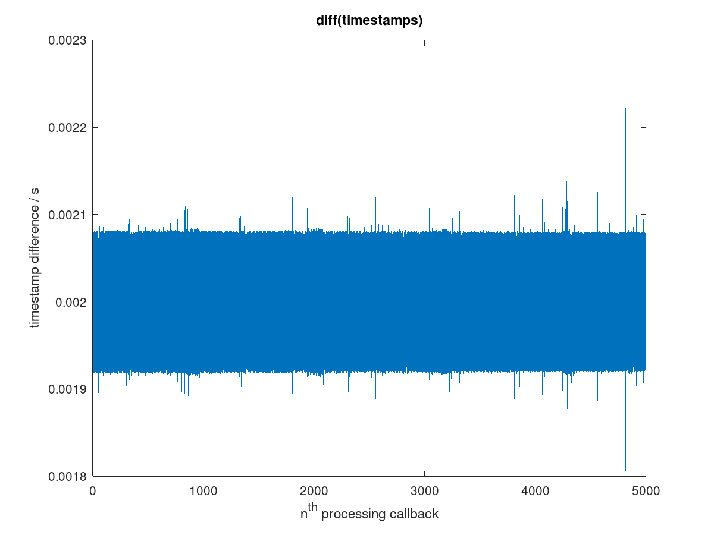
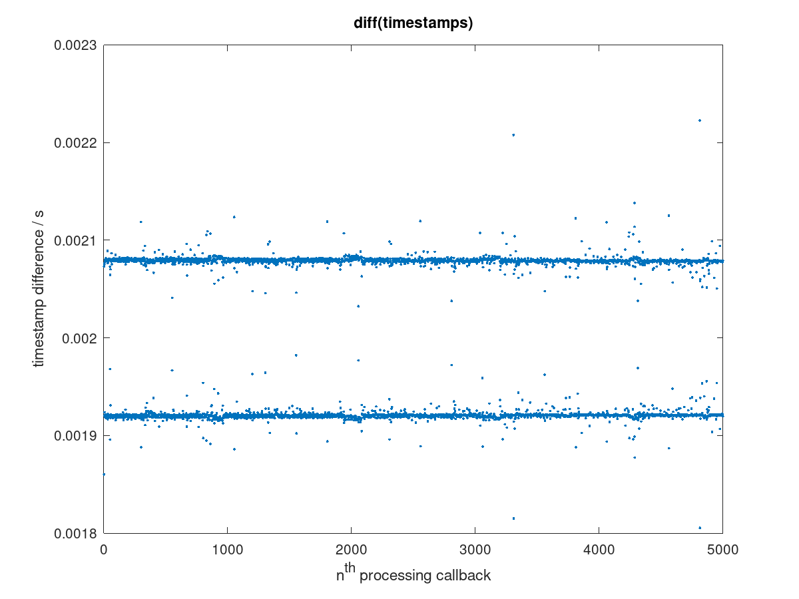
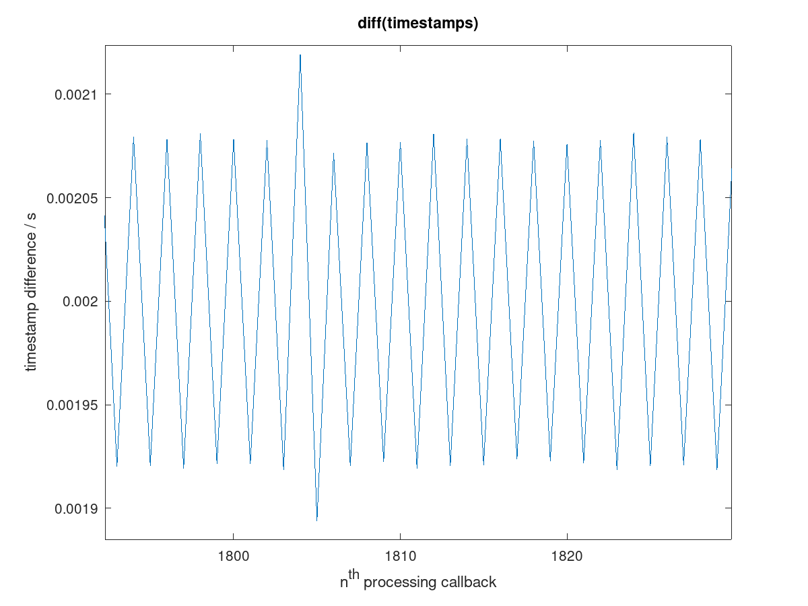

The fluctuations in timestamp differences in file `bpi-r48-p96.mat` shown in this plot
 are not randomm fluctuations as can be seen when plotting the same data as a scatter plot:
```
load bpi-r48-p96.mat;
plot(diff(timestamper),'.');title 'diff(timestamps)', xlabel 'n^{th} processing callback', ylabel 'timestamp difference / s'
```


The timestamp differences show some major quantization and some minor additional noise. The quant size can be computed as
```
median(diff(timestamper)(diff(timestamper)>0.002)) - median(diff(timestamper)(diff(timestamper)<0.002))
```
which is 158.31μs.  However, neither median is an integral
multiple of the quant size.

Zooming in on the first plot shows that the time difference
alternates between the longer and the shorter quantization:

